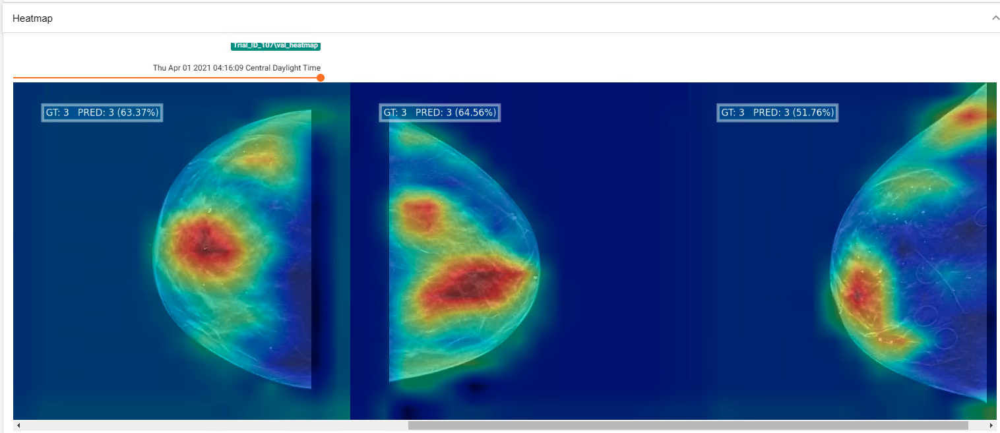

"# TF2_Heatmap_Callback" 

```
heatmap = Add_Heatmap(log_dir=tensorboard_output, validation_data=validation_generator.data_set,
                      validation_steps=len(validation_generator),
                      class_names=class_names, frequency=5)
```

<p align="center">
    
</p>