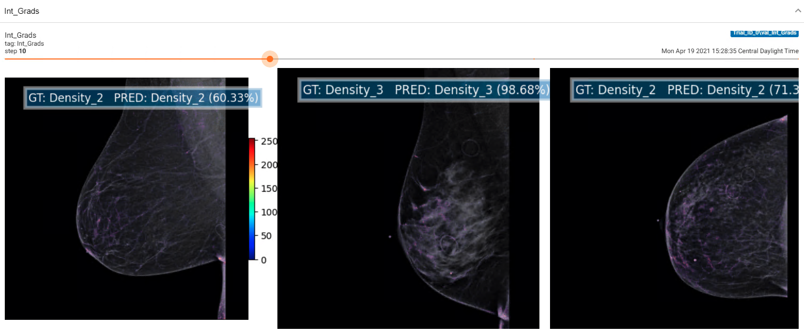

# TF2_Heatmap_Callback

### Integrated gradient Callback for Tensorflow
```
    int_grad = Add_Integrated_Gradients(log_dir=tensorboard_output, validation_data=validation_generator.data_set,
                          validation_steps=len(validation_generator),
                          class_names=class_names, frequency=5, colormap_as_contour=False, nb_channels=nb_channel)
```
### Output images in Tensorboard
<p align="center">
    
</p>

### Grad Cam Callback for Tensorflow
```
    grad_cam = Add_Grad_CAM(log_dir=tensorboard_output, validation_data=validation_generator.data_set,
                          validation_steps=len(validation_generator),
                          class_names=class_names, frequency=5, colormap_as_contour=True)
```
### Output images in Tensorboard
<p align="center">
    
</p>
